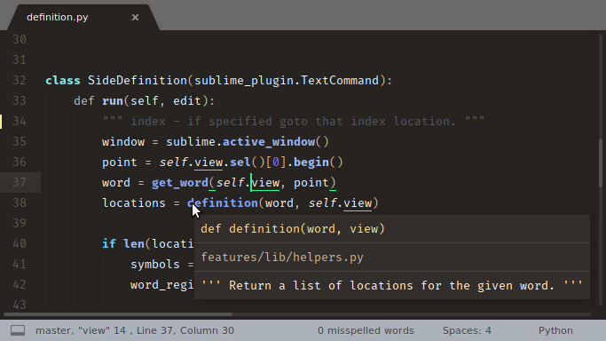
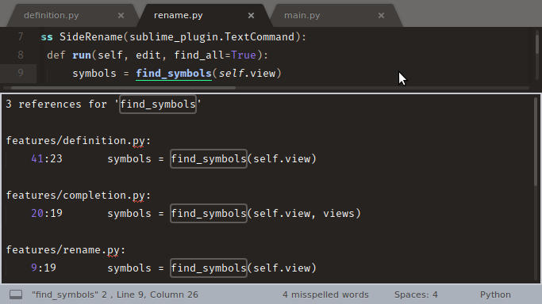
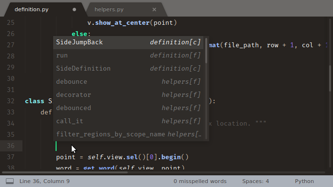
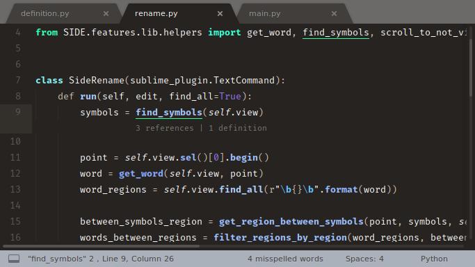
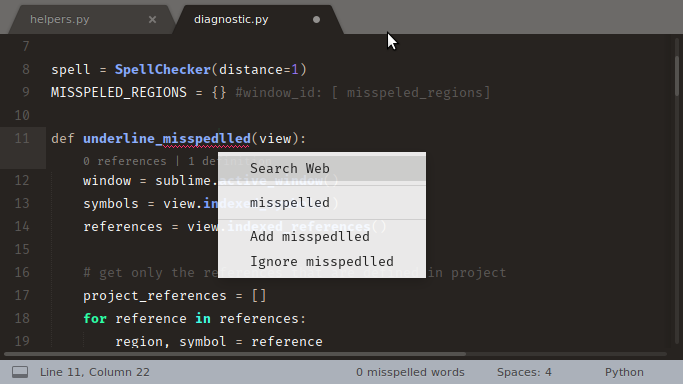

## SIDE 

SIDE makes Sublime just a bit more useful.
The goal of SIDE is to mimic LSP features without language servers and without any protocol. It uses only the things that are already in Sublime.

How is that even possible?
Well SIDE is smart as much as you are. 
You can be the best or the worst language server. That depends on you. 
SIDE will just try to help as much as it can.

### Features
* Definition
* Hover
* Show Signature
* Completion
* Reference
* Code Lens
* Code Actions
* Rename
* Diagnostic


Show signature help when hovering over `function/class` symbols or when typing a `(` after a function call. You can also trigger it with a key binding.



Rename will select all occurrences of the given word in a function scope. SIDE knows what a function call is, and when you try to rename a variable that is called `sel` it will not select `sel` if it is a function call, and vice versa.


Rename can also select all occurrences of the word in a file. 


Show all references for the given symbol in a panel. Sometimes it is useful to go cycle through the references in just the open views, for that there is a key binding in the SIDE preferences.   



Completions will show all the symbols and words found in the opened views, with the type of the symbol and the file from where it is found. The types can be:
* `[c]` - class
* `[m]` - method
* `[f]` - function
* `[#]` - unknown, but it exist somewhere in the open views, probably a variable, or a word in a comment



Code lens show you the count of references and definitions.



Never misspell a function name again. Just set Sublime's `spell_check` setting to `true`. 



Code actions can correct spelling mistakes and search the Internet.

When you need an advice or are in doubt. Don't know if you should do this or that? You can ask SIDE, and it will give you the answer. 

SIDE <3 Chuck. Chuck will help you to get through the day with a smile. And that is what matter the most :)

### Configure SIDE

Assign all the SIDE key bindings, you can skip some you don't want.


Sometimes you would want to configure SIDE to know what are references or definitions, because the default `SOME_LANGAUGE.tmPreferences` didn't account for them or maybe there are some symbols you wouldn't like to be in the index. 

In that case you need to configure some `tmPreferences` files. To add these symbols to the `IndexedSymbolList` or to the `IndexedReferenceList`.

Here is SIDE's configuration for your language `X`. 

Adding references. 
Create a `{YourLanguage}References.tmPreferences` and save it to your `Packages\User` or `SIDE/languages`(if you plan to do a Pull Request to add this configuration to SIDE) folder. All the strings bellow `scope` key will be added to the references list. 
With the following content:
```xml
<?xml version="1.0" encoding="UTF-8"?>
<plist version="1.0">
<dict>
	<key>scope</key>
	<string>support.function.rust</string>
	<key>settings</key>
	<dict>
		<key>showInIndexedReferenceList</key>
		<string>1</string>
	</dict>
</dict>
</plist>
```

Here is how SIDE's configuration for rust looks like. The file is named `RustReferences.tmPreferences` and is placed in `SIDE/languages` folder.

```xml
<?xml version="1.0" encoding="UTF-8"?>
<plist version="1.0">
<dict>
	<key>scope</key>
	<string>support.function.rust</string>
	<key>settings</key>
	<dict>
		<key>showInIndexedReferenceList</key>
		<string>1</string>
	</dict>
</dict>
</plist>
```

Adding definitions. 
Create a `{YourLanguage}IndexedSymbols.tmPreferences` and save it to your `Packages\User` or `SIDE/languages`(if you plan to do a Pull Request to add this configuration to SIDE) folder. All the strings bellow `scope` key will be added to the definition list. 
With the following content:
```xml
<?xml version="1.0" encoding="UTF-8"?>
<plist version="1.0">
<dict>
	<key>name</key>
	<string>Rust Symbols</string>
	<key>scope</key>
	<string>entity.name.function.rust, entity.name.macro.rust, entity.name.struct.rust, entity.name.enum.rust, entity.name.module.rust, entity.name.type.rust, entity.name.impl.rust, entity.name.trait.rust</string>
	<key>settings</key>
	<dict>
		<key>showInIndexedSymbolList</key>
		<integer>1</integer>
	</dict>
</dict>
</plist>
```

### What is the point of SIDE?

The point of SIDE is to make you think. It is great to have great auto completion, diagnostics, ..., but where is the fun in that. You rarely make mistakes then?

When you use SIDE, it won't warn you if you make mistakes (except if it is a spelling mistake and you enabled spell checking). We all make mistakes and we should learn from them.
